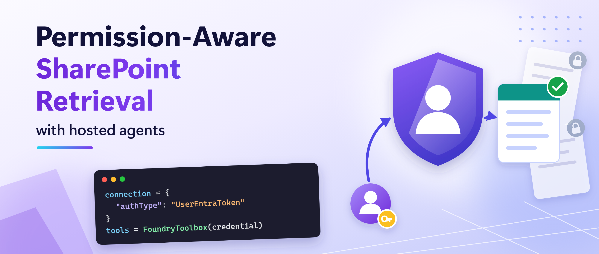
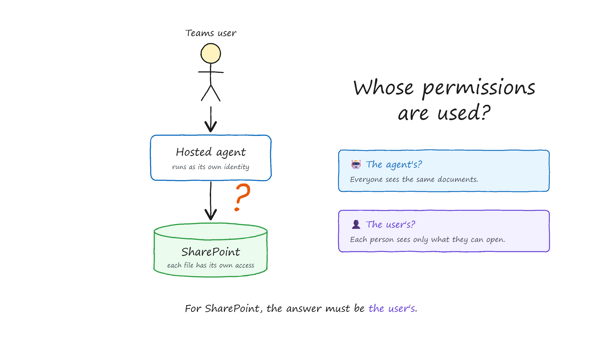
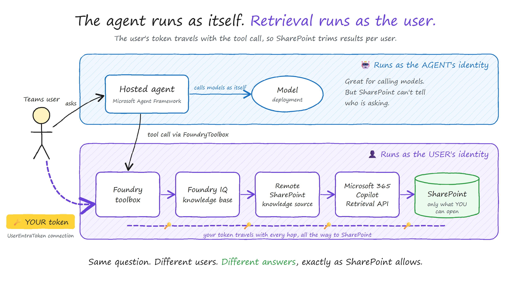
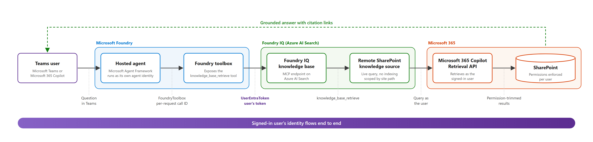

# Permission-aware SharePoint retrieval with hosted agents



Build an agent on **hosted agents in Foundry Agent Service** that answers from SharePoint **as the
signed-in user**, and publish it to Microsoft Teams. It uses a Foundry IQ knowledge base with a
remote SharePoint knowledge source, connected through the Foundry toolbox, so every answer reflects
what each person is allowed to open. There's no custom server to host and no client secret in the
retrieval path.

> **Note:** Remote SharePoint knowledge sources in Foundry IQ were in preview at the time of writing.

## Why agent identity is not enough



Hosted agents run as their own agent identity. That works for calling models, but SharePoint
permissions belong to people. If retrieval runs as the agent, SharePoint can't check the asking
user's access, so the user's token has to reach the retrieval step.

## How it works



1. **`FoundryToolbox`** in [main.py](sharepoint-kb-agent/src/sharepoint-kb-agent/main.py) sends the
   per-request call ID with each tool call, so Foundry knows which user the call belongs to.
2. **A `UserEntraToken` connection** passes that user's Microsoft Entra ID token to the knowledge
   base on Azure AI Search. This is identity passthrough (On-Behalf-Of).
3. **A remote SharePoint knowledge source** queries SharePoint live through the Microsoft 365
   Copilot Retrieval API as that user, scoped to the site paths you choose. Nothing is indexed.



## Repository contents

| Path | Purpose |
| --- | --- |
| [setup/](setup/) | Creates the knowledge base, the Foundry connection and the toolbox |
| [sharepoint-kb-agent/](sharepoint-kb-agent/) | The hosted agent and its `azd` manifest |
| [scripts/](scripts/) and [infra/](infra/) | Publish to Microsoft Teams through the REST API. Needed for private-network projects |

## Prerequisites

| Role | Required permissions |
| --- | --- |
| Setup user | **Search Service Contributor** on the Azure AI Search service, and rights to create connections and toolboxes in the Foundry project |
| End users | **Search Index Data Reader** on the Search service, **Foundry Agent Consumer** on the agent, a **Microsoft 365 Copilot** licence, and access to the documents in SharePoint |
| Agent identity | **Foundry User** on the Foundry project, for model calls |

You also need:

- A Foundry project with a `gpt-4.1` (or equivalent) model deployment. Any project works. For a
  private-network setup, deploy it with the
  [private network standard agent setup](https://github.com/microsoft-foundry/foundry-samples/tree/main/infrastructure/infrastructure-setup-bicep/15-private-network-standard-agent-setup)
  template.
- An Azure AI Search service in a
  [region that supports agentic retrieval](https://learn.microsoft.com/azure/search/search-region-support),
  in the same Microsoft Entra tenant as Microsoft 365, with
  [role-based access enabled](https://learn.microsoft.com/azure/search/search-security-enable-roles)
  (`az search service update --auth-options aadOrApiKey`). On a new service, wait until
  `az search service show --query status` returns `running` before running the setup scripts.
- Azure CLI, Python 3.11+, PowerShell 7+, and `azd` 1.27.1+ with `azd ext install microsoft.foundry`.

Grant the Search role to a security group of end users:

```powershell
$SEARCH_ID = az search service show -n <SEARCH_SERVICE> -g <SEARCH_RESOURCE_GROUP> --query id -o tsv
az role assignment create --assignee <GROUP_OBJECT_ID> --role "Search Index Data Reader" --scope $SEARCH_ID
```

## Deploy

1. **Configure the setup scripts.** Fill in `setup/.env`. `KNOWLEDGE_SOURCES_JSON` takes one entry
   per SharePoint path, on one line.

   ```powershell
   cd setup
   python -m venv .venv
   .\.venv\Scripts\Activate.ps1
   python -m pip install -r requirements.txt
   Copy-Item .env.example .env
   ```

2. **Create the knowledge base, connection and toolbox.** Each script creates what's missing and
   validates what already exists, without overwriting.

   ```powershell
   python .\create_knowledge_base.py
   python .\create_connection.py
   python .\create_toolbox.py
   ```

3. **Deploy the hosted agent.** Run `azd ai agent init` from an empty folder **outside this
   repository** (the repo's `.gitignore` excludes `deploy/`, which makes `azd` fail with
   `pathspec '*' did not match any files`), and pass the absolute path to
   [azure.yaml](sharepoint-kb-agent/azure.yaml).

   ```powershell
   $PROJECT_ID = "/subscriptions/<SUBSCRIPTION_ID>/resourceGroups/<RESOURCE_GROUP>/providers/Microsoft.CognitiveServices/accounts/<FOUNDRY_ACCOUNT>/projects/<PROJECT>"

   New-Item -ItemType Directory -Force -Path "$HOME/sharepoint-kb-deploy" | Out-Null
   Set-Location "$HOME/sharepoint-kb-deploy"
   azd ai agent init -m "<path-to-repo>/sharepoint-kb-agent/azure.yaml" `
     --project-id $PROJECT_ID --model-deployment gpt-4.1 --no-prompt --force -e sharepoint-kb

   Set-Location ./sharepoint-kb-agent
   azd env set enableHostedAgentVNext true -e sharepoint-kb
   azd env set AZURE_AI_MODEL_DEPLOYMENT_NAME gpt-4.1 -e sharepoint-kb
   azd env set TOOLBOX_NAME sp-kb-tools -e sharepoint-kb   # same as TOOLBOX_NAME in setup/.env
   azd up -e sharepoint-kb
   ```

4. **Test it.**

   ```powershell
   azd ai agent invoke --new-session "What does our onboarding guide say about MFA setup?" --timeout 120
   ```

## Publish to Teams

**Project with public network access:** in the Foundry portal, open the agent and select
**Publish to Teams and Microsoft Copilot**. Foundry creates and manages the Azure Bot for you, so
you don't need the script or `infra/`.

**Private-network project:** the portal button isn't available. Use the script, which follows the
[REST publish flow](https://learn.microsoft.com/azure/foundry/agents/how-to/publish-copilot-virtual-network):
it creates the Azure Bot from [bot-service.bicep](infra/bot-service.bicep), opens the agent's
Activity Protocol route to Microsoft 365 traffic only, and calls the publish API.

```powershell
<path-to-repo>/scripts/Publish-AgentToTeams.ps1 `
    -ResourceGroup <RESOURCE_GROUP> -AgentName sharepoint-kb-agent `
    -ProjectEndpoint https://<FOUNDRY_ACCOUNT>.services.ai.azure.com/api/projects/<PROJECT> `
    -UseM365PublicEndpoint -DisplayName "SharePoint KB Agent" -PublishScope Tenant -AppVersion 1.0.0
```

- Run it from a client that can reach the project's private endpoint.
- Azure Bot names are globally unique. The default bot name is the agent name plus a short hash
  of the project endpoint; pass `-BotName` to choose your own.
- `-PublishScope Tenant` needs Microsoft 365 admin approval. The default, `Shared`, publishes to you only.
- Add `-WhatIf` to preview without changing anything.

## Verify

A good answer doesn't prove the right permissions were used. Pick a document that user A can open
and user B can't, then have both ask about it in separate Teams conversations:

| User | SharePoint access | Expected result |
| --- | --- | --- |
| A | Can open the document | Answer from the document, with a citation link |
| B | Cannot open the document | "The available sources do not contain the answer." |

Repeat the test after any permission change.

## Learn more

- [Create a remote SharePoint knowledge source](https://learn.microsoft.com/azure/search/agentic-knowledge-source-how-to-sharepoint-remote)
- [Connect a Foundry IQ knowledge base to Foundry Agent Service](https://learn.microsoft.com/azure/foundry/agents/how-to/foundry-iq-connect)
- [Toolbox authentication](https://learn.microsoft.com/azure/foundry/agents/how-to/tools/tool-authentication)
- [Publish agents to Microsoft 365 by using the REST API](https://learn.microsoft.com/azure/foundry/agents/how-to/publish-copilot-virtual-network)

## Acknowledgements

Thanks to **Mahya Gheini** and **Linda Li** from the Microsoft Foundry product team for their
guidance on toolboxes and knowledge bases. The setup scripts build on Mahya's samples.
